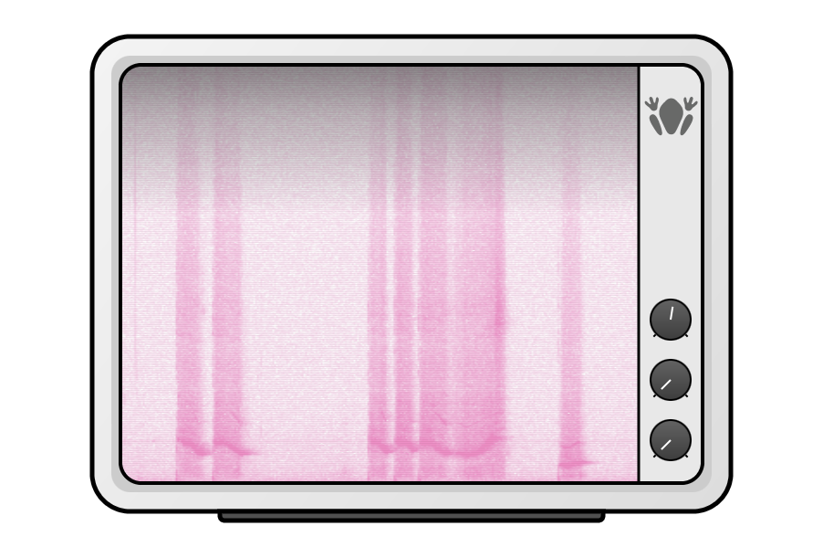

# AudioSpectrogram

A real-time spectrogram plugin built with JUCE that visualizes the frequency content of audio directly inside your DAW. 
Designed for both detailed analysis and creative sound exploration.

## Features

Real-time spectrogram display of incoming audio.

Intuitive visualization of frequency vs. time.

Customizable color mapping for clear readability.

Lightweight and efficient for seamless use in DAWs.

Supports common plugin formats (VST3 / AU).

## Example Output

## How It Works

Load the plugin in your DAW.

Route any audio signal through it.

The spectrogram updates in real time, showing how the frequency content evolves over time.

Adjust dials to change the spectrogram speed and frequency range.

## Installation

Build using JUCE with CMake or Projucer.

Export to your preferred plugin format (VST3 / AU).

Copy the compiled plugin into your DAW’s plugin folder.

## Applications

Audio signal analysis

Music production & mixing

Educational demonstrations of time–frequency concepts

Creative sound design
